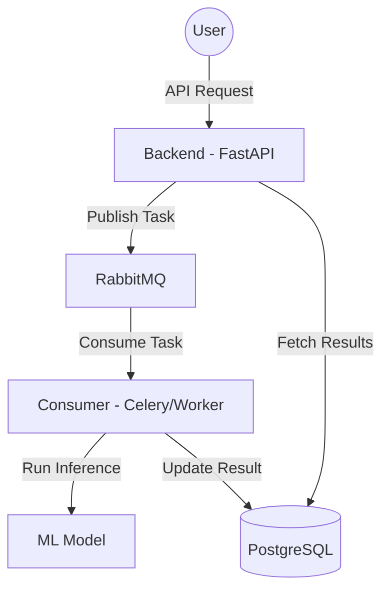

# Design Document: Enhancing Project Documentation

## 1. Overview
The goal is to update the root `README.md` to provide a more comprehensive overview of the project architecture and setup. The current README is minimal, and the project has grown to include distinct `backend` and `consumer` components that interact via RabbitMQ and PostgreSQL.

## 2. Analysis of Current README
The current `README.md` provides:
- Basic project description.
- Prerequisites (Docker/Compose).
- Service list (Postgres, RabbitMQ, Consumer, Backend).
- Basic installation and run commands.

Missing:
- Architectural context (data flow, interactions).
- Detailed component descriptions.
- Development insights.
- Visual representation of the architecture.

## 3. Proposed Enhancements
The updated `README.md` will follow this structure:
- **Project Title & Description**: Keep current but expand for clarity.
- **Architecture Overview**: Add a section describing how components interact (FastAPI -> RabbitMQ -> Consumer -> DB).
- **Architecture Diagram**: Include a Mermaid sequence/flow diagram.
- **Key Components**:
    - `backend/`: API layer (FastAPI), data persistence.
    - `consumer/`: Background processing (ML model execution), interaction with RabbitMQ.
- **Project Structure**: A brief tree/summary of folders.
- **Detailed Setup & Development**: Keep original setup but add instructions on how to access internal docs (if any) or common development workflows.

## 4. Mermaid Architecture Diagram
The architecture should highlight the interaction flow:

## 5. Implementation Strategy
- Read original `README.md`.
- Replace content following the proposed structure.
- Integrate the Mermaid diagram using the syntax above.
- Ensure all technical commands are accurate to the current `docker-compose.yml` (e.g., ports).
- Use descriptive headings for readability.
