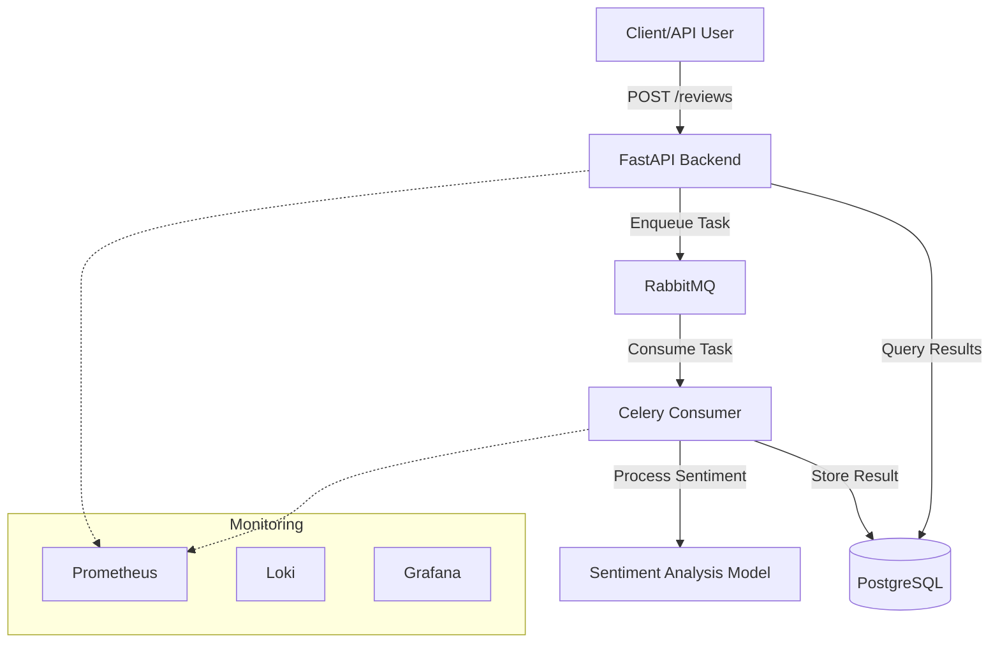

# DESIGN.md - README Enhancement Proposal

## Overview
The goal is to enhance the root `README.md` to provide better insights into the project architecture, tech stack, and data flow.

## Current Limitations
- Lacks a high-level architectural diagram.
- Does not clearly define the role of the components.
- Lacks information on the observability stack (Prometheus/Loki/Grafana).
- Minimal explanation of the data processing pipeline.

## Proposed Structure for `README.md`

### 1. Title & Description
Keep the current title and improve the description to include: "A distributed system for automated sentiment analysis, utilizing FastAPI for the REST API and Celery for asynchronous background processing."

### 2. Architecture Diagram (Mermaid)
Add an architecture overview:

### 3. Tech Stack
- **Frameworks**: FastAPI (Backend), Celery (Consumer).
- **Database**: PostgreSQL (with Alembic for migrations).
- **Messaging**: RabbitMQ.
- **ML**: Custom sentiment analysis model.
- **Observability**: Prometheus, Loki, Grafana.
- **Infrastructure**: Docker & Docker Compose.

### 4. Detailed Component Descriptions
- **Backend (`/backend`)**: Handles incoming requests for sentiment analysis, provides endpoints to query results.
- **Consumer (`/consumer`)**: Asynchronous worker node. Consumes tasks from RabbitMQ, executes the sentiment analysis model, and persists data to PostgreSQL.
- **Database (`/backend/app/db`)**: Standard SQL storage for reviews, companies, and customers.
- **Observability (`/dashboards`, `/configs`)**: Detailed metrics and log configurations using Prometheus and Loki.

### 5. Workflow Explanation
1. User sends a review to `POST /reviews`.
2. Backend receives the request, stores the raw review in the DB (or directly queues it), and triggers an asynchronous task via RabbitMQ.
3. The Celery Consumer picks up the task from RabbitMQ.
4. The Consumer runs the `sentiment_analysis.py` model.
5. The result is updated in the PostgreSQL database.

### 6. Updates to Setup
- Retain existing Docker commands.
- Add a section on how to check logs (mention Loki).
- Add a section on how to access Grafana (if applicable, based on ports).

## Implementation Details
- All edits will be made to `README.md` in the root directory.
- Use `markdown` formatting for readability.
- Ensure the Mermaid syntax is compatible with GitHub's markdown renderer.
