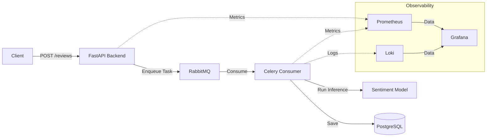

# System zur Sentiment-Analyse

Dieses Projekt implementiert eine asynchrone Pipeline zur Sentiment-Analyse von Nutzerbewertungen und nutzt ein Machine-Learning-Modell, um Feedback automatisch zu kategorisieren.

## Architekturübersicht

Die Anwendung folgt einem asynchronen Task-Queue-Muster, um eine skalierbare und entkoppelte Verarbeitung von Nutzerbewertungen zu gewährleisten:

- **API-Schicht (FastAPI)**: Stellt Endpunkte bereit, um Bewertungen zu empfangen und die Verarbeitung an eine Hintergrund-Task-Queue auszulagern.
- **Messaging-Schicht (RabbitMQ)**: Fungiert als Message Broker zwischen der API und dem Hintergrund-Worker.
- **Verarbeitungsschicht (Celery Consumer)**: Hört auf die Message Queue, führt ML-Sentiment-Analysen mit vortrainierten Modellen durch und speichert das Ergebnis in der Datenbank.
- **Datenbankschicht (PostgreSQL)**: Speichert Firmen-, Bewertungs- und Kundendaten.
- **Observability-Schicht**: 
    - **Prometheus/Celery Exporter**: Sammelt System- und Task-Metriken.
    - **Loki**: Aggregiert Logs zur Fehlersuche.
    - **Grafana**: Bietet Visualisierung von Metriken und Logs.

## Systemdiagramm



## Tech-Stack

- **API**: FastAPI
- **Task Queue**: Celery, RabbitMQ
- **Datenbank**: PostgreSQL
- **Monitoring**: Prometheus, Loki, Grafana

## Voraussetzungen

- [Docker](https://docs.docker.com/get-docker/)
- [Docker Compose](https://docs.docker.com/compose/install/)

## Einrichtung & Ausführung

1. **Repository klonen**:
   ```sh
   git clone <repository-url>
   cd <repository-directory>
   ```

2. **Container bauen und starten**:
   ```sh
   docker compose up --build
   ```
   Dieser Befehl initialisiert den gesamten Stack, einschließlich Backend, Consumer, Message Broker, Datenbank und dem Observability-Stack.

3. **Container-Status prüfen**:
   ```sh
   docker ps
   ```

4. **Container stoppen**:
   ```sh
   docker compose down
   ```

## Monitoring

Das Projekt enthält einen Observability-Stack, der über Grafana zugänglich ist.

- **Grafana**: Verfügbar unter `http://localhost:3000` (Standardzugangsdaten).
- **Dashboards**: Vorkonfigurierte Dashboards befinden sich im Verzeichnis `/dashboards`. Sie können diese direkt in Grafana importieren, um den Systemzustand, die Anfragelatenz und die Metriken der Sentiment-Analyse zu visualisieren.

## Überprüfung

Um sicherzustellen, dass das System korrekt funktioniert:
1. Stellen Sie sicher, dass alle Container über `docker ps` laufen.
2. Greifen Sie auf die API-Dokumentation unter `http://localhost:8000/docs` zu und senden Sie eine Testbewertung ab.
3. Überprüfen Sie die Logs im Terminal oder verwenden Sie Loki/Grafana, um zu verifizieren, dass der Task vom Celery-Worker verarbeitet wurde.
4. Betrachten Sie die Metriken in Grafana, um den Durchsatz der Bewertungsverarbeitung und die Systemauslastung zu sehen.

Reviewer last review: 2025-05-22
