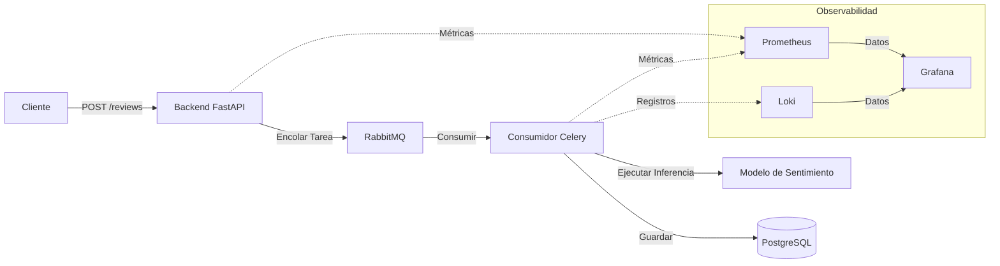

# Sistema de Análisis de Sentimientos

Este proyecto implementa una tubería (pipeline) asíncrona de análisis de sentimientos para reseñas de usuarios, utilizando un modelo de aprendizaje automático (machine learning) para categorizar los comentarios automáticamente.

## Resumen de la Arquitectura

La aplicación sigue un patrón de cola de tareas asíncronas para garantizar un procesamiento escalable y desacoplado de las reseñas de los usuarios:

- **Capa de API (FastAPI)**: Sirve puntos finales (endpoints) para recibir reseñas y delega el procesamiento a una cola de tareas en segundo plano.
- **Capa de Mensajería (RabbitMQ)**: Actúa como el intermediario (broker) de mensajes entre la API y el trabajador (worker) en segundo plano.
- **Capa de Procesamiento (Consumidor de Celery)**: Escucha la cola de mensajes, realiza el análisis de sentimientos mediante ML utilizando modelos preentrenados y persiste el resultado en la base de datos.
- **Capa de Base de Datos (PostgreSQL)**: Almacena datos de empresas, reseñas y clientes.
- **Capa de Observabilidad**: 
    - **Prometheus/Celery Exporter**: Recopila métricas del sistema y de las tareas.
    - **Loki**: Agrega registros (logs) para la resolución de problemas.
    - **Grafana**: Proporciona visualización de métricas y registros.

## Diagrama del Sistema



## Stack Tecnológico

- **API**: FastAPI
- **Cola de tareas**: Celery, RabbitMQ
- **Base de datos**: PostgreSQL
- **Monitoreo**: Prometheus, Loki, Grafana

## Prerrequisitos

- [Docker](https://docs.docker.com/get-docker/)
- [Docker Compose](https://docs.docker.com/compose/install/)

## Configuración y Ejecución

1. **Clonar el repositorio**:
   ```sh
   git clone <url-del-repositorio>
   cd <directorio-del-repositorio>
   ```

2. **Construir y ejecutar los contenedores**:
   ```sh
   docker compose up --build
   ```
   Este comando inicializa toda la infraestructura, incluidos el backend, el consumidor, el intermediario de mensajes, la base de datos y la capa de observabilidad.

3. **Verificar el estado de los contenedores**:
   ```sh
   docker ps
   ```

4. **Detener los contenedores**:
   ```sh
   docker compose down
   ```

## Monitoreo

El proyecto incluye una capa de observabilidad accesible a través de Grafana.

- **Grafana**: Disponible en `http://localhost:3000` (credenciales por defecto).
- **Paneles (Dashboards)**: Los paneles preconfigurados se pueden encontrar en el directorio `/dashboards`. Puede importarlos directamente a Grafana para visualizar la salud del sistema, la latencia de las solicitudes y las métricas de procesamiento de análisis de sentimientos.

## Cómo verificar

Para verificar que el sistema funciona correctamente:
1. Asegúrese de que todos los contenedores estén en ejecución mediante `docker ps`.
2. Acceda a la documentación de la API en `http://localhost:8000/docs` y envíe una reseña de prueba.
3. Revise los registros (logs) en la terminal o utilice Loki/Grafana para verificar que la tarea fue procesada por el trabajador de Celery.
4. Visualice las métricas en Grafana para ver el rendimiento del procesamiento de reseñas y la utilización de los recursos del sistema.
