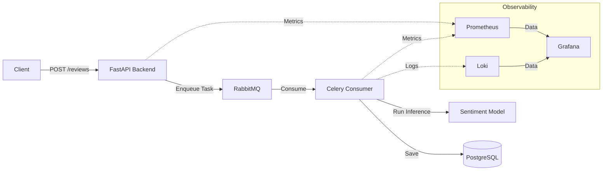

# Système d'Analyse de Sentiment

Ce projet implémente un pipeline asynchrone d'analyse de sentiment pour les avis utilisateurs, utilisant un modèle d'apprentissage automatique (machine learning) pour catégoriser les retours automatiquement.

## Aperçu de l'Architecture

L'application suit un modèle de file d'attente de tâches asynchrone pour assurer un traitement évolutif et découplé des avis utilisateurs :

- **Couche API (FastAPI)** : Sert des points de terminaison pour recevoir les avis et décharge le traitement vers une file d'attente de tâches en arrière-plan.
- **Couche de Messagerie (RabbitMQ)** : Agit comme courtier de messages entre l'API et le travailleur (worker) en arrière-plan.
- **Couche de Traitement (Consommateur Celery)** : Écoute la file d'attente de messages, effectue l'analyse de sentiment ML à l'aide de modèles pré-entraînés, et persiste le résultat dans la base de données.
- **Couche Base de Données (PostgreSQL)** : Stocke les données des entreprises, des avis et des clients.
- **Couche d'Observabilité** : 
    - **Prometheus/Celery Exporter**: Collecte les métriques système et de tâches.
    - **Loki**: Agrège les journaux (logs) pour le dépannage.
    - **Grafana**: Fournit une visualisation des métriques et des journaux.

## Diagramme du Système



## Pile Technologique

- **API**: FastAPI
- **File d'attente de tâches**: Celery, RabbitMQ
- **Base de données**: PostgreSQL
- **Surveillance**: Prometheus, Loki, Grafana

## Prérequis

- [Docker](https://docs.docker.com/get-docker/)
- [Docker Compose](https://docs.docker.com/compose/install/)

## Installation & Exécution

1. **Cloner le dépôt**:
   ```sh
   git clone <url-du-depot>
   cd <repertoire-du-projet>
   ```

2. **Construire et démarrer les conteneurs**:
   ```sh
   docker compose up --build
   ```
   Cette commande initialise toute la pile, y compris le backend, le consommateur, le courtier de messages, la base de données et la pile d'observabilité.

3. **Vérifier l'état des conteneurs**:
   ```sh
   docker ps
   ```

4. **Arrêter les conteneurs**:
   ```sh
   docker compose down
   ```

## Surveillance

Le projet inclut une pile d'observabilité accessible via Grafana.

- **Grafana**: Disponible sur `http://localhost:3000` (identifiants par défaut).
- **Tableaux de bord**: Les tableaux de bord préconfigurés se trouvent dans le répertoire `/dashboards`. Vous pouvez les importer directement dans Grafana pour visualiser la santé du système, la latence des requêtes et les métriques de traitement de l'analyse de sentiment.

## Comment vérifier

Pour vérifier que le système fonctionne correctement :
1. Assurez-vous que tous les conteneurs sont en cours d'exécution via `docker ps`.
2. Accédez à la documentation de l'API sur `http://localhost:8000/docs` et soumettez un avis de test.
3. Vérifiez les journaux dans le terminal ou utilisez Loki/Grafana pour vérifier que la tâche a été traitée par le travailleur Celery.
4. Consultez les métriques dans Grafana pour voir le débit de traitement des avis et l'utilisation des ressources système.
