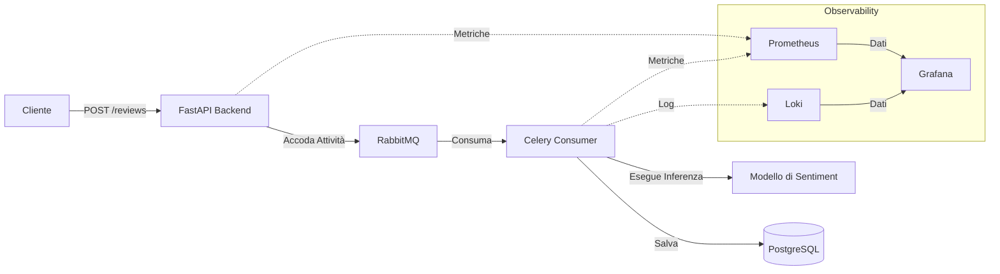

# Sistema di Analisi del Sentiment

Questo progetto implementa una pipeline asincrona di analisi del sentiment per le recensioni degli utenti, utilizzando un modello di machine learning per categorizzare automaticamente il feedback.

## Panoramica dell'Architettura

L'applicazione segue un pattern asincrono basato su code di attività (task-queue) per garantire un'elaborazione scalabile e disaccoppiata delle recensioni degli utenti:

- **API Layer (FastAPI)**: Gestisce gli endpoint per ricevere le recensioni e delega l'elaborazione a una coda di attività in background.
- **Messaging Layer (RabbitMQ)**: Agisce come message broker tra l'API e il worker in background.
- **Processing Layer (Celery Consumer)**: Si mette in ascolto sulla coda dei messaggi, esegue l'analisi del sentiment tramite modelli di ML pre-addestrati e salva il risultato nel database.
- **Database Layer (PostgreSQL)**: Archivia i dati di aziende, recensioni e clienti.
- **Observability Layer**:
    - **Prometheus/Celery Exporter**: Raccoglie metriche di sistema e delle attività.
    - **Loki**: Aggrega i log per la risoluzione dei problemi.
    - **Grafana**: Fornisce la visualizzazione di metriche e log.

## Diagramma di Sistema



## Stack Tecnologico

- **API**: FastAPI
- **Task Queue**: Celery, RabbitMQ
- **Database**: PostgreSQL
- **Monitoraggio**: Prometheus, Loki, Grafana

## Prerequisiti

- [Docker](https://docs.docker.com/get-docker/)
- [Docker Compose](https://docs.docker.com/compose/install/)

## Configurazione ed Esecuzione

1. **Clona la repository**:
   ```sh
   git clone <repository-url>
   cd <repository-directory>
   ```

2. **Costruisci ed avvia i container**:
   ```sh
   docker compose up --build
   ```
   Questo comando inizializza l'intero stack, inclusi il backend, il consumer, il message broker, il database e lo stack di osservabilità.

3. **Verifica lo stato dei container**:
   ```sh
   docker ps
   ```

4. **Ferma i container**:
   ```sh
   docker compose down
   ```

## Monitoraggio

Il progetto include uno stack di osservabilità accessibile tramite Grafana.

- **Grafana**: Disponibile su `http://localhost:3000` (credenziali predefinite).
- **Dashboard**: Le dashboard pre-configurate si trovano nella directory `/dashboards`. Puoi importarle direttamente in Grafana per visualizzare lo stato del sistema, la latenza delle richieste e le metriche di elaborazione dell'analisi del sentiment.

## Come Verificare

Per verificare che il sistema funzioni correttamente:
1. Assicurati che tutti i container siano in esecuzione tramite `docker ps`.
2. Accedi alla documentazione delle API su `http://localhost:8000/docs` e invia una recensione di prova.
3. Controlla i log nel terminale o utilizza Loki/Grafana per verificare che l'attività sia stata elaborata dal worker Celery.
4. Visualizza le metriche in Grafana per controllare il throughput di elaborazione delle recensioni e l'utilizzo delle risorse di sistema.
