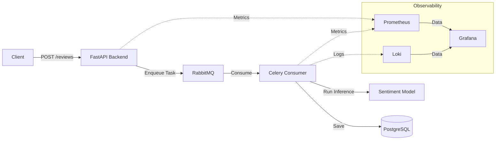

# 感情分析システム

このプロジェクトは、ユーザーレビューの非同期感情分析パイプラインを実装し、機械学習モデルを利用してフィードバックを自動的に分類します。

## アーキテクチャの概要

このアプリケーションは、ユーザーレビューのスケーラブルで分離された処理を確実にするため、非同期タスクキューパターンを採用しています。

- **APIレイヤー (FastAPI)**: レビューを受け取るためのエンドポイントを提供し、処理をバックグラウンドのタスクキューにオフロードします。
- **メッセージングレイヤー (RabbitMQ)**: APIとバックグラウンドワーカー間のメッセージブローカーとして機能します。
- **処理レイヤー (Celery Consumer)**: メッセージキューを監視し、事前学習済みモデルを使用して機械学習による感情分析を実行し、結果をデータベースに保存します。
- **データベースレイヤー (PostgreSQL)**: 企業、レビュー、顧客データを保存します。
- **可観測性レイヤー**: 
    - **Prometheus/Celery Exporter**: システムとタスクのメトリクスを収集します。
    - **Loki**: トラブルシューティングのためにログを集約します。
    - **Grafana**: メトリクスとログの可視化を提供します。

## システム図



## 技術スタック

- **API**: FastAPI
- **Task Queue**: Celery, RabbitMQ
- **Database**: PostgreSQL
- **Monitoring**: Prometheus, Loki, Grafana

## 前提条件

- [Docker](https://docs.docker.com/get-docker/)
- [Docker Compose](https://docs.docker.com/compose/install/)

## セットアップと実行

1. **リポジトリのクローン**:
   ```sh
   git clone <repository-url>
   cd <repository-directory>
   ```

2. **コンテナのビルドと起動**:
   ```sh
   docker compose up --build
   ```
   このコマンドは、バックエンド、コンシューマー、メッセージブローカー、データベース、可観測性スタックを含むスタック全体を初期化します。

3. **コンテナの状態確認**:
   ```sh
   docker ps
   ```

4. **コンテナの停止**:
   ```sh
   docker compose down
   ```

## モニタリング

このプロジェクトには、Grafana経由でアクセス可能な可観測性スタックが含まれています。

- **Grafana**: `http://localhost:3000` で利用可能（デフォルトの資格情報を使用）。
- **ダッシュボード**: 事前構成されたダッシュボードは `/dashboards` ディレクトリにあります。これらを直接Grafanaにインポートして、システムの状態、リクエストのレイテンシ、感情分析処理のメトリクスを可視化できます。

## 検証方法

システムが正常に動作していることを検証するには:
1. `docker ps` で全てのコンテナが実行中であることを確認します。
2. `http://localhost:8000/docs` のAPIドキュメントにアクセスし、テストレビューを送信します。
3. ターミナルでログを確認するか、Loki/Grafanaを使用して、タスクがCeleryワーカーによって処理されたことを確認します。
4. Grafanaでメトリクスを表示し、レビュー処理のスループットとシステムリソースの使用状況を確認します。
