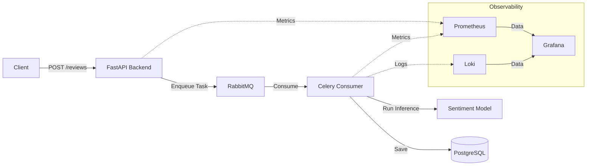

# Sentiment Analysis System

This project implements an asynchronous sentiment analysis pipeline for user reviews, utilizing a machine learning model to categorize feedback automatically.

## Architecture Overview

The application follows an asynchronous task-queue pattern to ensure scalable and decoupled processing of user reviews:

- **API Layer (FastAPI)**: Serves endpoints to receive reviews and offloads processing to a background task queue.
- **Messaging Layer (RabbitMQ)**: Acts as the message broker between the API and the background worker.
- **Processing Layer (Celery Consumer)**: Listens to the message queue, performs ML sentiment analysis using pre-trained models, and persists the result to the database.
- **Database Layer (PostgreSQL)**: Stores company, review, and customer data.
- **Observability Layer**: 
    - **Prometheus/Celery Exporter**: Collects system and task metrics.
    - **Loki**: Aggregates logs for troubleshooting.
    - **Grafana**: Provides visualization of metrics and logs.

## System Diagram



## Tech Stack

- **API**: FastAPI
- **Task Queue**: Celery, RabbitMQ
- **Database**: PostgreSQL
- **Monitoring**: Prometheus, Loki, Grafana

## Prerequisites

- [Docker](https://docs.docker.com/get-docker/)
- [Docker Compose](https://docs.docker.com/compose/install/)

## Setup & Running

1. **Clone the repository**:
   ```sh
   git clone <repository-url>
   cd <repository-directory>
   ```

2. **Build and start the containers**:
   ```sh
   docker compose up --build
   ```
   This command initializes the entire stack, including the backend, consumer, message broker, database, and the observability stack.

3. **Check container status**:
   ```sh
   docker ps
   ```

4. **Stop the containers**:
   ```sh
   docker compose down
   ```

## Local development

Tests are located in the `backend/tests` directory and can be executed using `pytest` within the backend environment.

The project includes an observability stack accessible via Grafana.

- **Grafana**: Available at `http://localhost:3000` (default credentials).
- **Dashboards**: Pre-configured dashboards can be found in the `/dashboards` directory. You can import these directly into Grafana to visualize system health, request latency, and sentiment analysis processing metrics.

## How to Verify

To verify the system is functioning correctly:
1. Ensure all containers are running via `docker ps`.
2. Access the API documentation at `http://localhost:8000/docs` and submit a test review.
3. Check the logs in the terminal or use Loki/Grafana to verify the task was processed by the Celery worker.
4. View metrics in Grafana to see the review processing throughput and system resource utilization.
