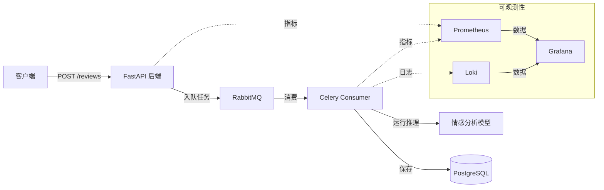

# 情感分析系统

本项目实现了一个用于用户评论的异步情感分析管道，利用机器学习模型自动对反馈进行分类。

## 架构概览

应用程序采用了异步任务队列模式，以确保用户评论处理的可扩展性和解耦：

- **API 层 (FastAPI)**：提供端点以接收评论，并将处理任务卸载到后台任务队列。
- **消息层 (RabbitMQ)**：充当 API 与后台工作者（Worker）之间的消息代理。
- **处理层 (Celery Consumer)**：监听消息队列，使用预训练模型进行 ML 情感分析，并将结果持久化到数据库。
- **数据库层 (PostgreSQL)**：存储公司、评论和客户数据。
- **可观测性层**：
    - **Prometheus/Celery Exporter**：收集系统和任务指标。
    - **Loki**：聚合日志以便排查问题。
    - **Grafana**：提供指标和日志的可视化。

## 系统架构图



## 技术栈

- **API**: FastAPI
- **任务队列**: Celery, RabbitMQ
- **数据库**: PostgreSQL
- **监控**: Prometheus, Loki, Grafana

## 前置要求

- [Docker](https://docs.docker.com/get-docker/)
- [Docker Compose](https://docs.docker.com/compose/install/)

## 设置与运行

1. **克隆仓库**:
   ```sh
   git clone <repository-url>
   cd <repository-directory>
   ```

2. **构建并启动容器**:
   ```sh
   docker compose up --build
   ```
   该命令将初始化整个技术栈，包括后端、消费者、消息代理、数据库以及可观测性套件。

3. **检查容器状态**:
   ```sh
   docker ps
   ```

4. **停止容器**:
   ```sh
   docker compose down
   ```

## 监控

该项目包含一个可通过 Grafana 访问的可观测性套件。

- **Grafana**: 访问地址 `http://localhost:3000` (使用默认凭据)。
- **仪表盘**: 预配置的仪表盘位于 `/dashboards` 目录中。您可以直接将其导入 Grafana，以可视化系统健康状况、请求延迟以及情感分析处理指标。

## 如何验证

验证系统是否正常运行：
1. 通过 `docker ps` 确保所有容器均在运行。
2. 访问 API 文档 `http://localhost:8000/docs` 并提交一条测试评论。
3. 查看终端中的日志或使用 Loki/Grafana 确认任务已被 Celery 工作者处理。
4. 在 Grafana 中查看指标，确认评论处理的吞吐量和系统资源利用率。
