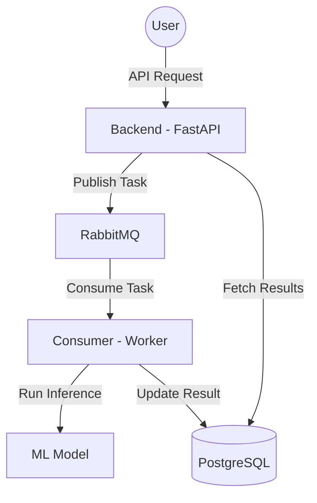

# Análise de Sentimento

Projeto que demonstra a utilização de modelos de aprendizagem na classificação de avaliação de usuários.

## Arquitetura
O sistema utiliza uma arquitetura baseada em eventos para processamento assíncrono de tarefas de análise de sentimento.



## Componentes Principais

- **`backend/`**: API desenvolvida com FastAPI. Responsável por receber requisições, publicar tarefas na fila e consultar resultados persistidos.
- **`consumer/`**: Worker de background responsável por processar as tarefas da fila, executar o modelo de ML e persistir os resultados no banco de dados.

## Requisitos
Antes de iniciar, certifique-se de ter instalado:
- [Docker](https://docs.docker.com/get-docker/)
- [Docker Compose](https://docs.docker.com/compose/install/)

## Estrutura do Projeto
```text
.
├── backend/        # API FastAPI
├── consumer/       # Processamento de tarefas e ML
├── configs/        # Configurações de serviços (Loki, Prometheus)
└── docker-compose.yml
```

## Configuração e Execução

### 1. Construir e Iniciar os Contêineres
Na raiz do projeto, execute:
```sh
docker compose up --build
```
Isso iniciará todos os serviços definidos no `docker-compose.yml`, incluindo monitoramento (Loki, Prometheus, Grafana).

### 2. Acessar a API
A API estará disponível em:
```
http://localhost:8000
```

### 3. Gerenciamento
Para parar os contêineres:
```sh
docker compose down
```
Para verificar o status dos contêineres:
```sh
docker ps
```
