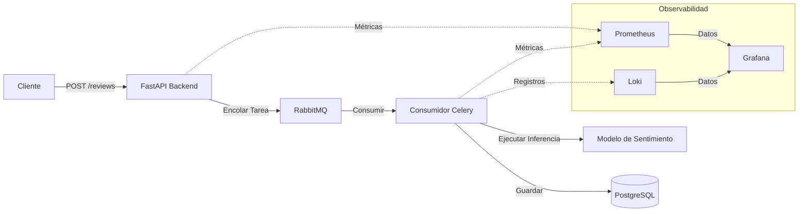

# Sistema de Análisis de Sentimiento

Este proyecto implementa un pipeline asíncrono de análisis de sentimiento para reseñas de usuarios, utilizando un modelo de aprendizaje automático para categorizar comentarios automáticamente.

## Descripción general de la arquitectura

La aplicación sigue un patrón de cola de tareas asíncrona para asegurar un procesamiento escalable y desacoplado de las reseñas de los usuarios:

- **Capa de API (FastAPI)**: Sirve puntos de conexión (endpoints) para recibir reseñas y delega el procesamiento a una cola de tareas en segundo plano.
- **Capa de Mensajería (RabbitMQ)**: Actúa como el intermediario de mensajes (message broker) entre la API y el trabajador de segundo plano.
- **Capa de Procesamiento (Consumidor Celery)**: Escucha la cola de mensajes, realiza análisis de sentimiento de ML utilizando modelos pre-entrenados, y persiste el resultado en la base de datos.
- **Capa de Base de Datos (PostgreSQL)**: Almacena datos de empresas, reseñas y clientes.
- **Capa de Observabilidad**: 
    - **Prometheus/Celery Exporter**: Recopila métricas del sistema y de las tareas.
    - **Loki**: Agrega registros (logs) para la resolución de problemas.
    - **Grafana**: Proporciona visualización de métricas y registros.

## Diagrama del Sistema



## Stack Tecnológico

- **API**: FastAPI
- **Cola de Tareas**: Celery, RabbitMQ
- **Base de Datos**: PostgreSQL
- **Monitoreo**: Prometheus, Loki, Grafana

## Requisitos Previos

- [Docker](https://docs.docker.com/get-docker/)
- [Docker Compose](https://docs.docker.com/compose/install/)

## Configuración y Ejecución

1. **Clonar el repositorio**:
   ```sh
   git clone <url-del-repositorio>
   cd <directorio-del-repositorio>
   ```

2. **Construir y levantar los contenedores**:
   ```sh
   docker compose up --build
   ```
   Este comando inicializa todo el stack, incluyendo el backend, el consumidor, el intermediario de mensajes, la base de datos y el stack de observabilidad.

3. **Verificar el estado de los contenedores**:
   ```sh
   docker ps
   ```

4. **Detener los contenedores**:
   ```sh
   docker compose down
   ```

## Monitoreo

El proyecto incluye un stack de observabilidad accesible vía Grafana.

- **Grafana**: Disponible en `http://localhost:3000` (credenciales por defecto).
- **Tableros**: Los tableros pre-configurados se pueden encontrar en el directorio `/dashboards`. Puedes importar estos directamente en Grafana para visualizar la salud del sistema, la latencia de las solicitudes y las métricas de procesamiento del análisis de sentimiento.

## Cómo Verificar

Para verificar que el sistema funciona correctamente:
1. Asegúrate de que todos los contenedores estén ejecutándose mediante `docker ps`.
2. Accede a la documentación de la API en `http://localhost:8000/docs` y envía una reseña de prueba.
3. Revisa los logs en la terminal o utiliza Loki/Grafana para verificar que la tarea fue procesada por el trabajador (worker) de Celery.
4. Observa las métricas en Grafana para ver el rendimiento del procesamiento de reseñas y la utilización de los recursos del sistema.
