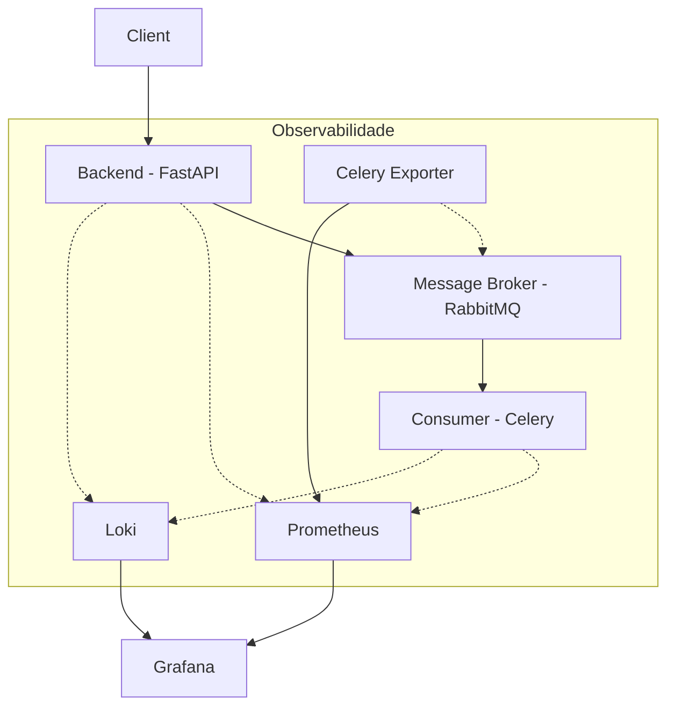

# Análise de Sentimentos

Projeto para análise de sentimentos de avaliações de usuários, utilizando um modelo de aprendizado de máquina para classificação. O sistema é composto por uma API FastAPI, um consumidor Celery para processamento assíncrono e uma stack de monitoramento completa.

## Arquitetura

O sistema segue uma arquitetura orientada a eventos para o processamento de avaliações:



## Componentes

- **Backend (FastAPI)**: API para receber avaliações e enfileirar para processamento.
- **Consumer (Celery)**: Processa as avaliações de forma assíncrona utilizando modelos de ML.
- **RabbitMQ**: Broker de mensagens (necessário, mas não incluído no compose atual).
- **Monitoramento**:
    - **Prometheus**: Coleta e armazena métricas.
    - **Loki**: Coleta e armazena logs.
    - **Grafana**: Visualização de métricas e logs.
    - **Celery Exporter**: Exporta métricas do Celery para o Prometheus.

## Pré-requisitos
- [Docker](https://docs.docker.com/get-docker/)
- [Docker Compose](https://docs.docker.com/compose/install/)

## Configuração e Execução

### 1. Clonar o Repositório
```sh
git clone <URL_DO_REPOSITORIO>
cd <NOME_DO_REPOSITORIO>
```

### 2. Configuração de Variáveis de Ambiente
Certifique-se de configurar as variáveis de ambiente necessárias (`.env`) tanto para o `backend` quanto para o `consumer`, conforme as definições de `docker-compose.yml`.

### 3. Construir e Iniciar os Contêineres
Execute o seguinte comando na raiz do projeto:
```sh
docker compose up --build
```

### 4. Acessar os Serviços
- **API**: `http://localhost:8000`
- **Grafana**: `http://localhost:3000`
- **Prometheus**: `http://localhost:9090`
- **Loki**: `http://localhost:3100`

### 5. Parar os Contêineres
```sh
docker compose down
```
