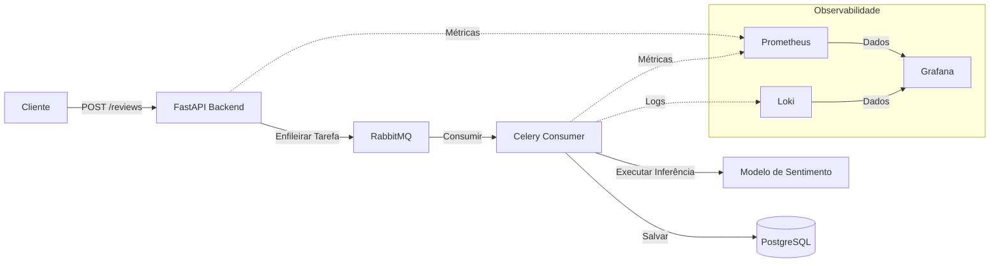

# Sistema de Análise de Sentimento

Este projeto implementa um pipeline assíncrono de análise de sentimento para avaliações de usuários, utilizando um modelo de aprendizado de máquina para categorizar feedbacks automaticamente.

## Visão Geral da Arquitetura

A aplicação segue um padrão de fila de tarefas assíncrona para garantir um processamento escalável e desacoplado das avaliações dos usuários:

- **Camada de API (FastAPI)**: Fornece endpoints para receber avaliações e delega o processamento para uma fila de tarefas em segundo plano.
- **Camada de Mensageria (RabbitMQ)**: Atua como o broker de mensagens entre a API e o worker em segundo plano.
- **Camada de Processamento (Celery Consumer)**: Escuta a fila de mensagens, executa a análise de sentimento por ML usando modelos pré-treinados e persiste o resultado no banco de dados.
- **Camada de Banco de Dados (PostgreSQL)**: Armazena dados de empresas, avaliações e clientes.
- **Camada de Observabilidade**:
    - **Prometheus/Celery Exporter**: Coleta métricas do sistema e das tarefas.
    - **Loki**: Agrega logs para solução de problemas.
    - **Grafana**: Fornece visualização de métricas e logs.

## Diagrama do Sistema



## Stack Tecnológica

- **API**: FastAPI
- **Fila de Tarefas**: Celery, RabbitMQ
- **Banco de Dados**: PostgreSQL
- **Monitoramento**: Prometheus, Loki, Grafana

## Pré-requisitos

- [Docker](https://docs.docker.com/get-docker/)
- [Docker Compose](https://docs.docker.com/compose/install/)

## Configuração e Execução

1. **Clone o repositório**:
   ```sh
   git clone <url-do-repositorio>
   cd <diretorio-do-repositorio>
   ```

2. **Construa e inicie os containers**:
   ```sh
   docker compose up --build
   ```
   Este comando inicializa toda a stack, incluindo o backend, o consumer, o broker de mensagens, o banco de dados e a stack de observabilidade.

3. **Verifique o status dos containers**:
   ```sh
   docker ps
   ```

4. **Pare os containers**:
   ```sh
   docker compose down
   ```

## Monitoramento

O projeto inclui uma stack de observabilidade acessível via Grafana.

- **Grafana**: Disponível em `http://localhost:3000` (credenciais padrão).
- **Dashboards**: Dashboards pré-configurados podem ser encontrados no diretório `/dashboards`. Você pode importá-los diretamente no Grafana para visualizar a saúde do sistema, latência de requisições e métricas de processamento de análise de sentimento.

## Como Verificar

Para verificar se o sistema está funcionando corretamente:
1. Garanta que todos os containers estejam rodando via `docker ps`.
2. Acesse a documentação da API em `http://localhost:8000/docs` e envie uma avaliação de teste.
3. Verifique os logs no terminal ou use o Loki/Grafana para confirmar que a tarefa foi processada pelo worker do Celery.
4. Visualize as métricas no Grafana para ver o throughput de processamento das avaliações e a utilização de recursos do sistema.
